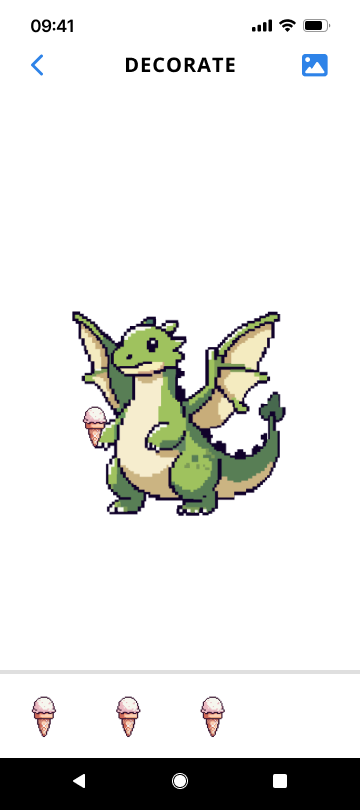
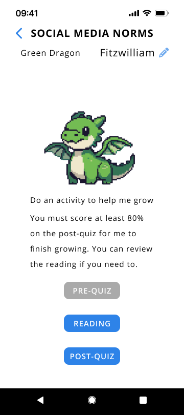

# Software Requirements

Gamified Education App for Young Adults on the Autism Spectrum

| Product Information      |  |
| :---              |     ----:                 |
| Project Name      | Gamified Education App    |
| Project Owner     | Xinru Page                |
| Version           | 1.0                       |
| Date Last Updated | January 22, 2025          |

## Introduction

Gamified Education App is an educational app where users complete learning activities for various lessons of a given course to earn rewards. Each lesson has some main activities. After the user completes each activity an associated 'pet/animal' with the lesson will grow. Once the lesson is complete the user will be able to decorate the animal's environment with small objects and background scenes. These decorations are earned through the user completing extra practices from the various lessons.

## App Walk Through

The image below is a sample of an initial download of the app. The user can edit his or her name in the top left-hand corner of the screen. The `Next Activity` widget will auto-update to tell the user what's next for the user to complete.

When a lesson is unlocked or open for the user to begin a question mark icon is shown in place of the animal the user will be given for this lesson. Once the first activity is completed the animal will be revealed in baby form. A progress bar is shown on the lesson widget/dashboard to tell the user how close he or she is to completing the whole lesson.

If a lesson is locked this indicates that the user must complete other lessons first a lock icon will take the place of the animal. There will also be no progress bar and the lesson link will be disabled.

### Tutorial Lesson

The first lesson is a tutorial that has the same structure and behavior as the course lessons but different activities.

- Personalization survey
- App explanation
- Optional email sign-up to save progress online

### Lesson Screen

This is a sample lesson screen (using the tutorial lesson) before the user has completed any activities. The activities that the user can complete will be shown in the active app color (royal blue: #2E83E8). Locked/disabled activities will be in grey (#AAAAAA).

The user can edit and save a name for each animal.

Here is the progression after each activity. The home screen will also update along with the lesson screens to reflect the user's progress, allowing the user to get a snapshot of his or her progress throughout the course.

|  |  |  |
|-------------------------|-------------------------|-------------------------|
|  |  |  |

After completing the last activity the animal will be fully grown and the lesson screen will switch to the completed lesson screen, shown in the far right image and in the image below. The next lesson will also be unlocked.

The user can now switch between different growth phases of the animal, decorate the environment, and share the created image.

The book icon in the top right corner will allow the user to go back to lesson activities.

#### Growth Phases

Currently, there are three growth phases for each animal: baby, teen, and adult, so the number of lesson activities is limited to three. The user can change the growth phase displayed using the phase option in the bottom left corner.

#### Decorate Screen

When the user selects the decorate feature the screen below will appear.

The items at the bottom be dragged from the item library onto the main screen space. To remove the user can drag an item back into the library. In the sample image, there are multiple copies of one item. In actual deployment, there will be different items one of each that the user has unlocked. Locked items will not be shown here. 

The picture icon in the top right corner will allow the user to select different scenes for the animal. The sample below shows only one background option, but in deployment, there will be different options.

|  |  |
|-------------------------|-------------------------|

When the user exits with the back button in the top left corner the user's choices should be saved. If the user were to close the app and re-open the app the background scene and item selections should be the same.

#### Share Feature

... TBD ...

### Main Activities

#### Readings

Readings contain the main lesson content. The user can advance forward to the next page or backward to a previous page. A progress bar at the top tells the user where he or she is in the full reading. (All activities will have a progress bar).

The headphones icon is a button that will play a voiceover of the text in case the user has difficulty reading. This feature will allow the user to listen to the information. This feature is also available for quizzes and practices.

After the user is finished the user will get an updated picture of the animal showing how much the animal has grown.

 |  |  |  |
|----------------------|----------------------------|----------------------------|----------------------------| 

#### Quizzes

The user will complete a pre-quiz before reading and a post-quiz after reading. Both quizzes will work the same, but the pre-quiz has no required score. The post-quiz will require at least an 80% score. The user will be notified of this when the post-quiz becomes available. The user may review the reading if needed, but not earn anything by reviewing.

When answering the quiz questions the user is required to provide an answer before moving on to the next question. 
The arrow button in the bottom right corner is how the user will move to the next question. It will be disabled is the user has not selected an answer.
The last question will have a submit button instead of an arrow indicating the end of the quiz.

|  |  |  |  |
|------------------------|------------------------|------------------------|------------------------| 

A result screen will be displayed giving the user a summary of the correct and incorrect questions and quiz score.

If the quiz is the post quiz and the user has a score of 80% or higher a reward page will be shown. If the score is less than 80% the user will be asked to retake the quiz. There is no score requirement for the pre-quiz.

|  |  |
|------------------------|------------------------|

#### Earning Items through Practices

Returning back to the home screen after completing a lesson there will be an extra activity widget. The user will be able to select a lesson to complete these extra activities. After completing an extra activity the user will be able to unlock items and backgrounds for his or her animals that can be used with the decoration feature.

For this particular demo: The app uses the Social Media Skills and Safety course material, which includes readings, quizzes, and practices. Practices are the extra activity for this course.

Note: Practice widget should appear after the Social Media Norms Lesson is complete, not the tutorial. There are no practices for the tutorial lesson.

 |  |  |
|----------------------|----------------------------|----------------------------|

When the user selects the practice button a pop-up menu with all the available items and backgrounds will open. Items that have been unlocked will be shown, but disabled so they don't do anything. The locked items will be shown as question-mark and the user can select one.

Once an item is selected a new pop-up will display to ask the user to pick a lesson to practice. After a lesson is selected the practice will begin. Practices will follow a similar format as the quizzes, except the user is required to get every question correct.

|  |  | 
|----------------------------|----------------------------|

If the user's answer is incorrect he or she is required to try again until the answer is correct. After getting a correct answer the user may continue to the next question.

|  |  |
|----------------------------|----------------------------|

On the last question of the practice the button to continue will say submit to indicate the end of the practice and a reward screen will be shown.

|  |  |
|----------------------------|----------------------------|

## App Customizations

... TBD ...

Font, color theme